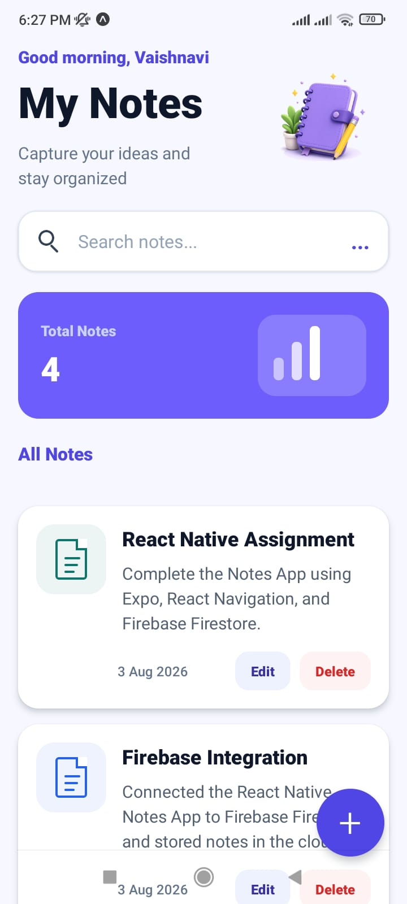
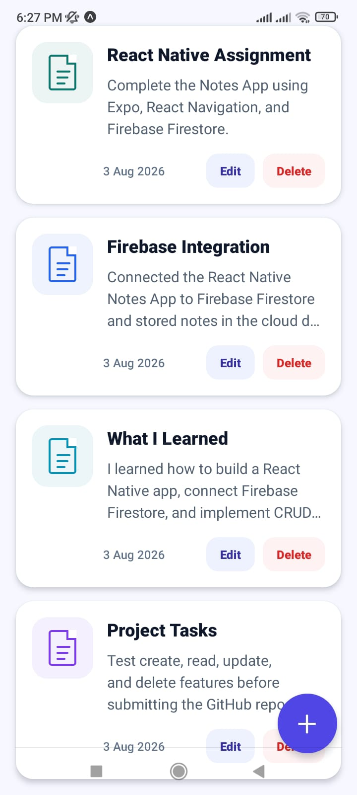
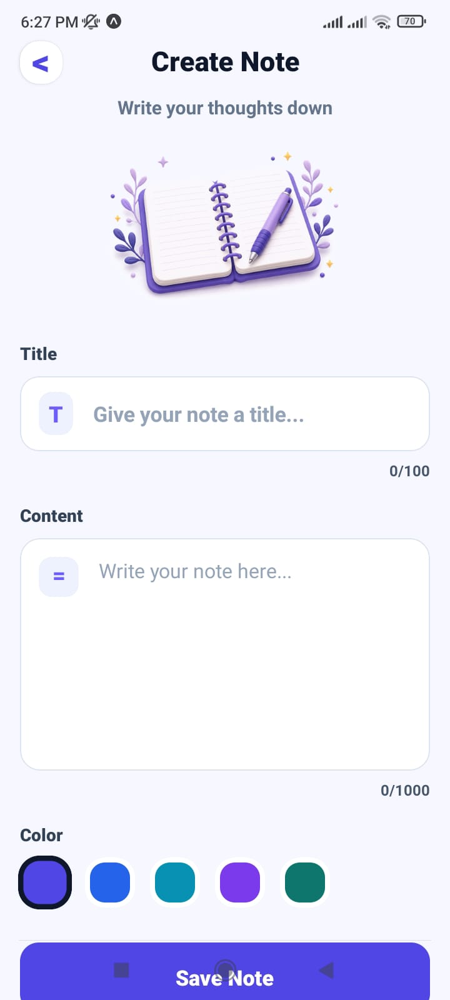
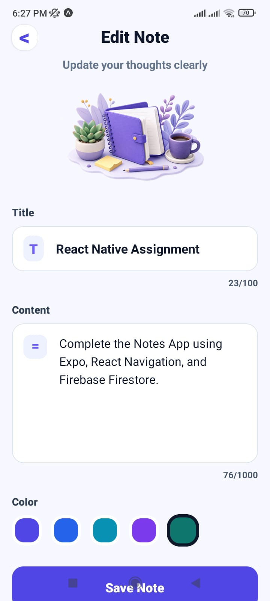
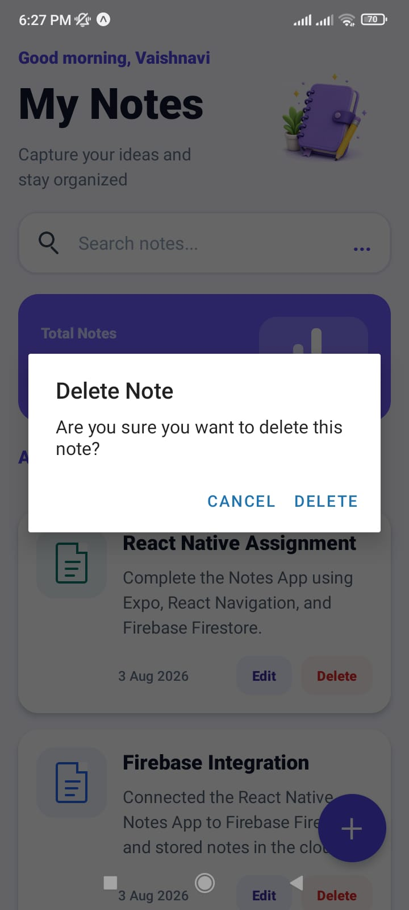

# 📒 React Native Notes App

A modern React Native Notes App built with **Expo** and **Firebase Firestore**. This application allows users to create, read, update, and delete notes with a clean, responsive, and user-friendly interface.

---

## ✨ Features

- 📝 Create Notes
- 📖 Read Notes
- ✏️ Update Notes
- 🗑️ Delete Notes
- 🔥 Firebase Firestore CRUD
- 🔍 Search Notes
- 🎨 Color Selection
- 📱 Responsive Mobile UI
- ⚡ Built with Expo

---

## 🛠 Tech Stack

- React Native
- Expo
- Firebase Firestore
- React Navigation
- Expo Vector Icons
- TypeScript

---

## 📸 Screenshots

### 🏠 Home Screen



### 📋 Notes List



### ➕ Create Note



### ✏️ Edit Note



### 🗑 Delete Confirmation



---

## 🎥 Demo Video

The complete application demo is included in this repository.

📹 **File:** `demo.mp4`

Download and play the video locally to see the application in action.

---

## 🚀 Installation

```bash
git clone https://github.com/VaishnaviSutharshan13/react-native-notes-app.git

cd react-native-notes-app

npm install

npx expo start
```

---

## 👩‍💻 Author

**Vaishnavi Sutharshan**

GitHub:
https://github.com/VaishnaviSutharshan13

---

## 📄 License

This project is licensed under the MIT License.